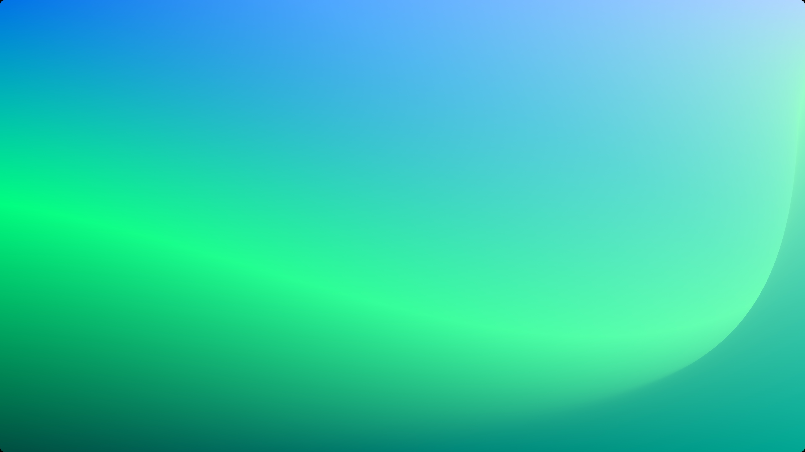

# MeshingKit



<a href="https://www.emergetools.com/app/example/ios/meshingkit.MeshingKit/release?utm_campaign=badge-data"></a>

MeshingKit provides an easy way to create mesh gradients in SwiftUI with predefined gradient templates to directly render beautiful, gorgeous gradients!

## Meshing

MeshingKit is based on [Meshing](https://apps.apple.com/in/app/ai-mesh-gradient-tool-meshing/id6567933550), an AI Mesh Gradient Tool. You can support my work by downloading the app or sponsoring this package.

## Features

- 63 predefined gradient templates:
  - 30 templates with 2x2 grid size
  - 22 templates with 3x3 grid size
  - 11 templates with 4x4 grid size
- Easily extendable for custom gradients
- Support for iOS 18.0+, macOS 15.0+, tvOS 18.0+, watchOS 11.0+, and visionOS 2.0+

## Installation

### Swift Package Manager

Add MeshingKit to your project using Swift Package Manager. In Xcode, go to File > Swift Packages > Add Package Dependency and enter the following URL:

```
https://github.com/rryam/MeshingKit.git
```

## Usage

To use a predefined gradient template:

```swift
import SwiftUI
import MeshingKit

struct ContentView: View {
    var body: some View {
        MeshingKit.gradientSize3(template: .cosmicAurora)
            .frame(width: 300, height: 300)
    }
}
```

## Available Gradient Templates

MeshingKit provides three sets of predefined gradient templates:

### GradientTemplateSize2 (2x2 grid)

- mysticTwilight
- tropicalParadise
- cherryBlossom
- arcticFrost
- goldenSunrise
- emeraldForest
- desertMirage
- midnightGalaxy
- autumnHarvest
- oceanBreeze
- lavenderDreams
- citrusBurst
- northernLights
- strawberryLemonade
- deepSea
- cottonCandy
- volcanicAsh
- springMeadow
- cosmicDust
- peacockFeathers
- crimsonSunset
- enchantedForest
- blueberryMuffin
- saharaDunes
- grapeSoda
- frostyWinter
- dragonFire
- mermaidLagoon
- chocolateTruffle
- neonNights

### GradientTemplateSize3 (3x3 grid)

- intelligence
- auroraBorealis
- sunsetGlow
- oceanDepths
- neonNight
- autumnLeaves
- cosmicAurora
- lavaFlow
- etherealMist
- tropicalParadise
- midnightGalaxy
- desertMirage
- frostedCrystal
- enchantedForest
- rubyFusion
- goldenSunrise
- cosmicNebula
- arcticAurora
- volcanicEmber
- mintBreeze
- twilightSerenade
- saharaDunes

### GradientTemplateSize4 (4x4 grid)

- auroraBorealis
- sunsetHorizon
- mysticForest
- cosmicNebula
- coralReef
- etherealTwilight
- volcanicOasis
- arcticFrost
- jungleMist
- desertMirage
- neonMetropolis

## Custom Gradients

Ccreate custom gradients by defining your own `GradientTemplate`:

```swift
let customTemplate = GradientTemplate(
    name: "Custom Gradient",
    size: 3,
    points: [
        .init(x: 0.0, y: 0.0), .init(x: 0.5, y: 0.0), .init(x: 1.0, y: 0.0),
        .init(x: 0.0, y: 0.5), .init(x: 0.5, y: 0.5), .init(x: 1.0, y: 0.5),
        .init(x: 0.0, y: 1.0), .init(x: 0.5, y: 1.0), .init(x: 1.0, y: 1.0)
    ],
    colors: [
        Color.red, Color.orange, Color.yellow,
        Color.green, Color.blue, Color.indigo,
        Color.purple, Color.pink, Color.white
    ],
    background: Color.black
)

let customGradient = MeshGradient(
    width: customTemplate.size,
    height: customTemplate.size,
    points: customTemplate.points,
    colors: customTemplate.colors
)
```

## Hex Color Initialization

There is an extension on `Color` that allows to initialise colors using hexadecimal strings:

```swift
let color = Color(hex: "#FF5733")
```

This extension supports various hex formats:

- "#RGB" (12-bit)
- "#RRGGBB" (24-bit)
- "#AARRGGBB" (32-bit with alpha)

## Contributing

Contributions to MeshingKit are welcome! Please feel free to submit a Pull Request.

## License

MeshingKit is available under the MIT license. See the LICENSE file for more info.
